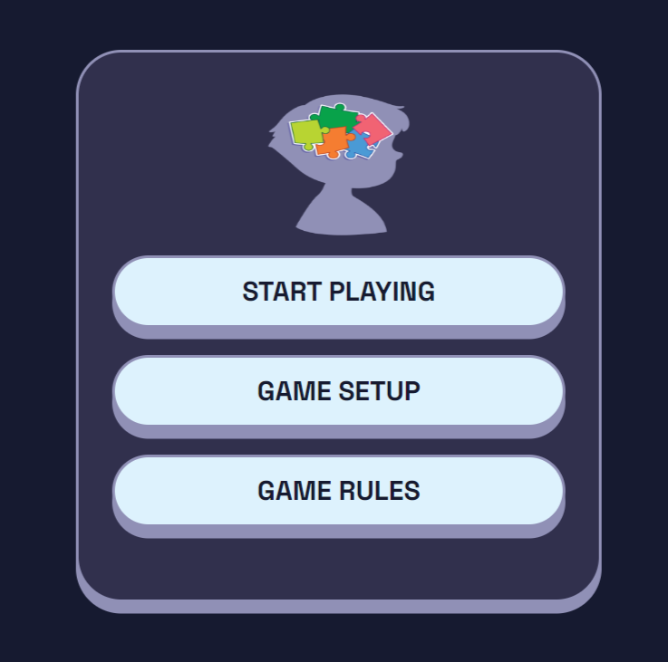
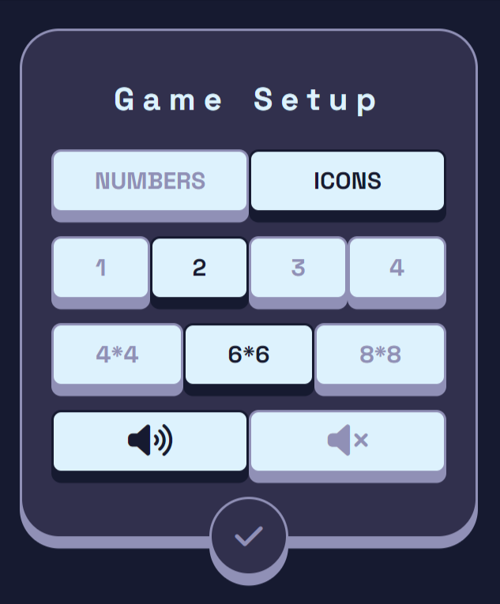
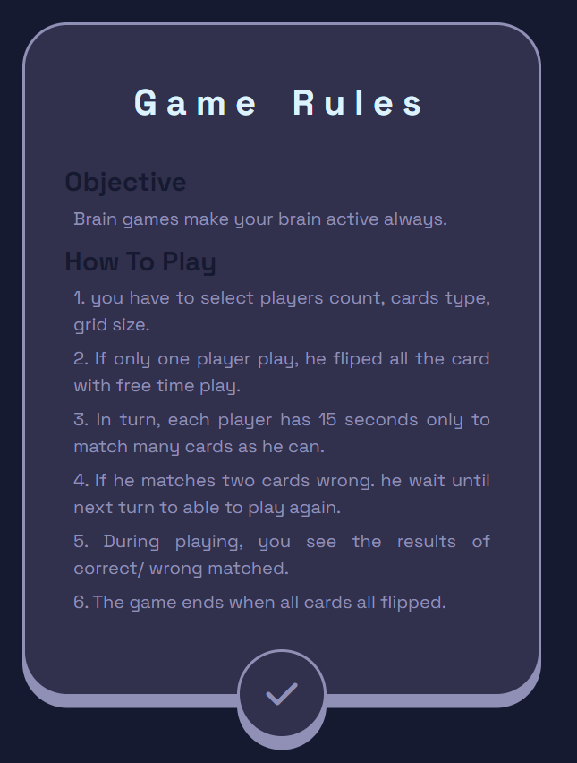
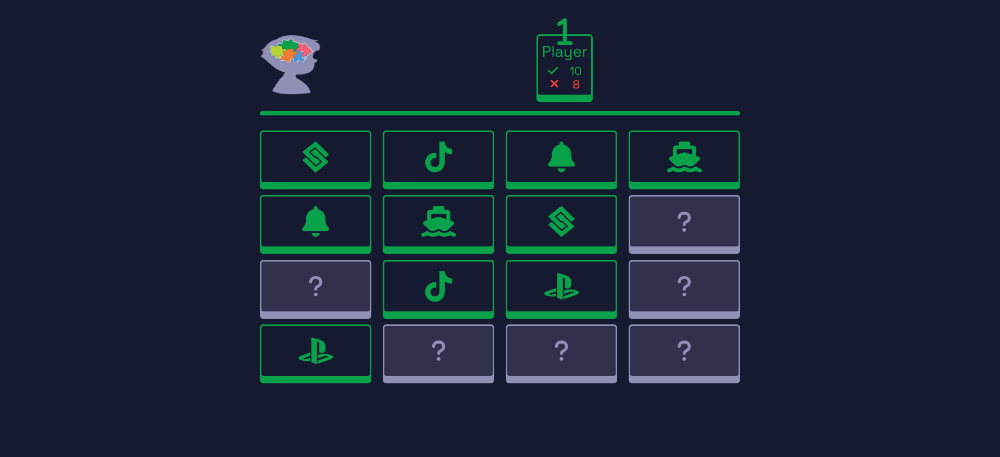
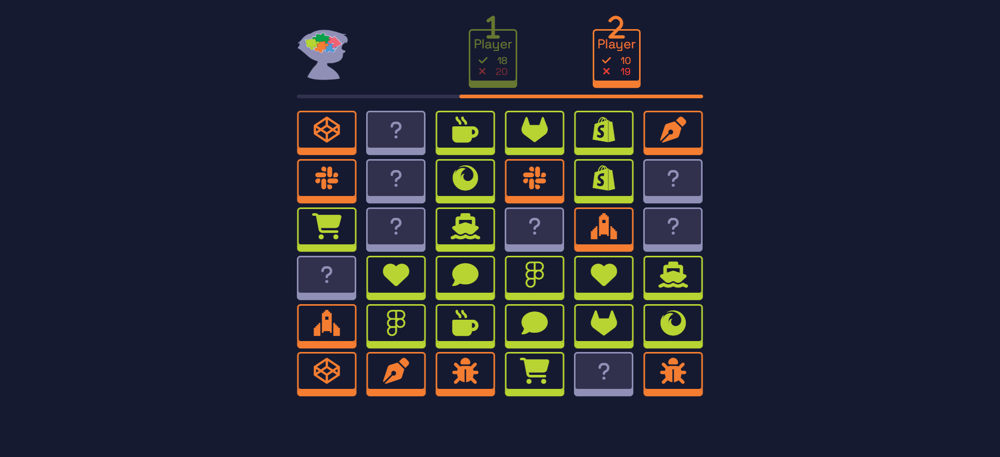
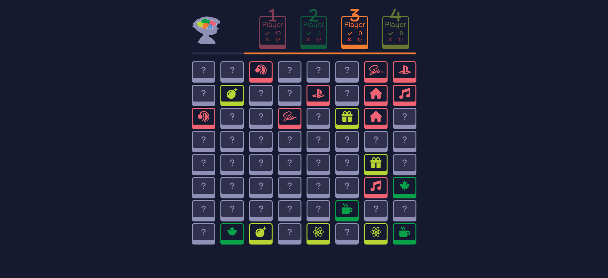
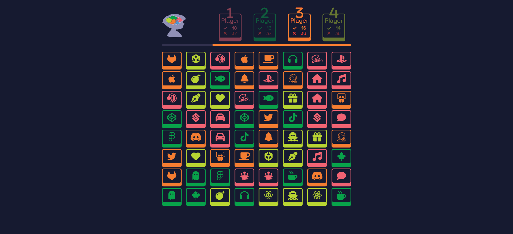

# Flip Card Game

## Project Description:-
    Developed a dynamic memory game with customizable options for card types, number of players, and grid sizes, making it suitable for solo play or multiplayer fun.

## Key Features:-
    🔹View game rules and customize game setup preferences.
    🔹Engage in solo challenges or compete with friends in multiplayer mode.
    🔹Test memory skills with multiple grid size options and card types.
    🔹Enjoy sound effects for an immersive gaming experience.
    🔹Track performance with real-time stats on correct and incorrect matches.

## Covered Topics:-
    🔹 HTML5
    🔹 Sass/ CSS3
    🔹 JavaScript/ ES6/ TypeScript
    🔹 DOM manipulation, JSON data handling
    🔹 Object-Oriented Programming principles.

## How to Play:- 
    🔹 Simply flip cards to find matching pairs within the given time limit. 
    🔹 The game ends when all pairs are successfully matched, and players can start a new game for endless entertainment!

## Live Demo: [Flip Card Game Live Demo](https://ahmedsaa3d.github.io/Flip-Card-Game/)

## GitHub Repository: [Flip Card Game GitHub Repository](https://github.com/AhmedSaa3d/Flip-Card-Game)
  
## Site Screenshots

